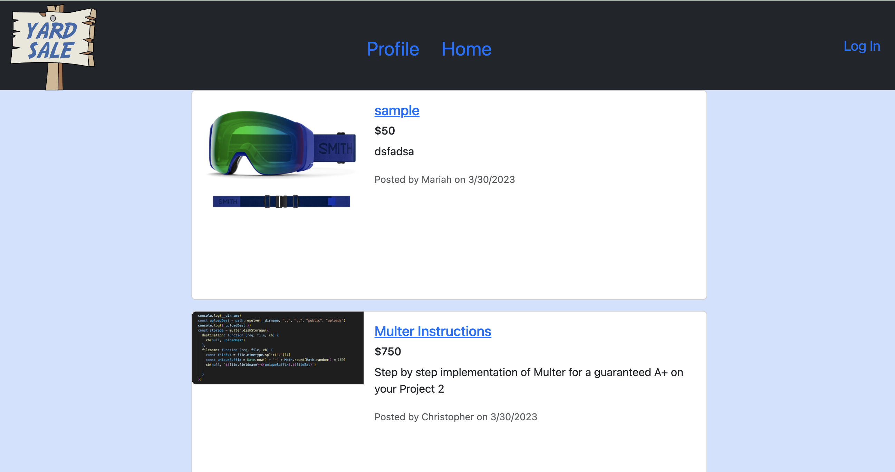

# Yard Sale
This project was designed to help users purchase premium items through a website where other users no longer need their items. 

By: Mariah Wear, David Lee, Joseph Serrato, and Christopher DuBois

## Table of contents

- [Overview](#overview)
  - [The challenge](#the-challenge)
  - [Screenshot](#screenshot)
  - [Links](#links)
- [Our process](#our-process)
  - [Built with](#built-with)
  - [Usage](#usage)
  - [What We learned](#what-we-learned)
  - [Continued development](#continued-development)
  - [Useful resources](#useful-resources)
- [Authors](#authors)
- [Acknowledgements](#acknowledgments)

## Overview

### The challenge

The challenge was to work together within a single github repository to build a functional full-stack application. 

## User Story
```
AS a buyer or seller of fine goods
I WANT to be able to purchase used items as well as having the ability to sell my own items
SO THAT i can continue to have the things i want and recycle the things I do not need
```
## Acceptance Criteria
```
GIVEN an interactive classifieds webpage 

WHEN I view the home page
THEN I see all the current for-sale listings

WHEN I click create a listing
THEN I can upload an image and item details which are posted to the site

WHEN I view a listings detail
THEN I see its image, price and description, and can click a button to purchase

WHEN I click to purchase an item and I’m logged in
THEN I see a modal to confirm or exit

When I try to purchase and I’m logged out
THEN I’m prompted to log in or sign up

WHEN I confirm my purchase
THEN the item is marked as sold and can no longer be purchased
```

### Screenshot

Screenshot of homepage: 

GIF to show functionality: 


### Links

- Solution URL: [Github Repo](https://github.com/mariahw4/yardsale)
- Live Site URL: [Deployed on Heroku](https://yardsale-application.herokuapp.com/)

## Our process

### Built with

* HTML
* Bootstrap
* JavaScript
* Node
* Handlebars
* SQL
* API
* Json
* [Multer](https://www.npmjs.com/package/multer)
* [express-handlebars](https://www.npmjs.com/package/express-handlebars)
* [MySQL2](https://www.npmjs.com/package/mysql2)
* [Sequelize](https://www.npmjs.com/package/sequelize) 
* [dotenv package](https://www.npmjs.com/package/dotenv) 
* [bcrypt package](https://www.npmjs.com/package/bcrypt)
* [express-session](https://www.npmjs.com/package/express-session) 
* [connect-session-sequelize](https://www.npmjs.com/package/connect-session-sequelize)

**Note**: The [express-session](https://www.npmjs.com/package/express-session) package stores the session data on the client in a cookie. When you are idle on the site for more than a set time, the cookie will expire and you will be required to log in again to start a new session. This is the default behavior and you do not have to do anything to your application other than implement the npm package.

### Usage

This application is straight forward to use.  On the first visit to the site the user is prompted to sign up for an account which logs them in.  While in logged out status the user is able to see the home page list of listings and even view individual listings.  From the user's profile they're able to see any listing they have created and also create a new listing.  

### What We learned

-The biggest thing we learned in this project was how to use Multer to upload images to our listing.  We had to set up local disk storage for the images as well to then be able to render them on the screen. 

-This project also helped expand our knowledge of teamwork within a github repository.  We practiced git etiquette and worked as a team to resolve any conflicts that arose along the way.  


### Continued development

This application has a lot of room for improvement.  A few features that we would love to have and work on moving forward are:
  - Functional search bar to find listings.
  - The ability to add multiple photos at once.
  - The ability to comment on listings.
  - The ability to see a list of all listings purchased on the profile page.
  - Bidding system.
  - The ability for the site to accept actual payment.

### Useful resources

https://www.w3schools.com/js/default.asp

https://ucb.bootcampcontent.com/UCB-Coding-Bootcamp/UCB-VIRT-FSF-PT-11-2022-U-LOLC

https://www.npmjs.com/package/multer

https://getbootstrap.com/docs/5.3/getting-started/introduction/


## Authors

- [Christopher DuBois - Github Profile](https://github.com/rhubarb414)
- [David Lee - Github Profile](https://github.com/kpxcrew)
- [Joseph Serrato - Github Profile](https://github.com/Jsrra)
- [Mariah Wear - Github Profile](https://github.com/mariahw4)


## Acknowledgments

We want to give a big thank you to Clarence for helping us make Multer work.  A big general thank you to Mark and the other TAs for the program! We would also love to give a specific thank you to Philip for helping us solve the problem when "nothing was wrong" and recommending Multer which should "only take about 30 minutes to setup"!
